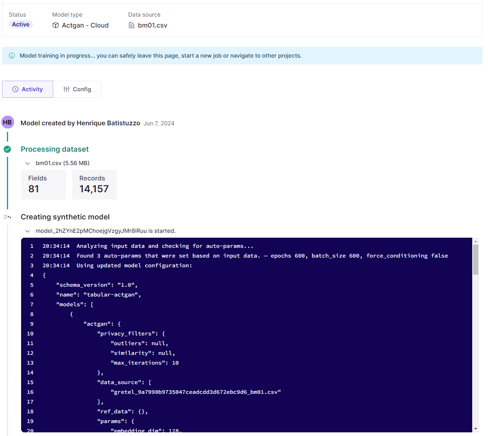
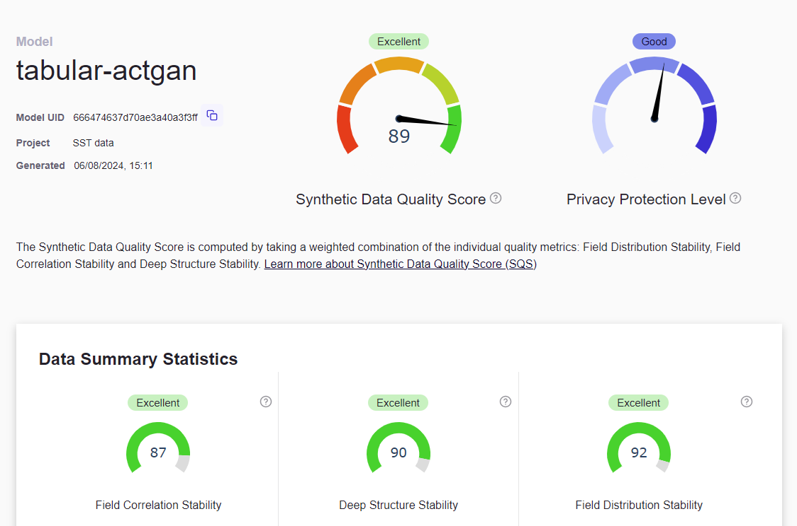
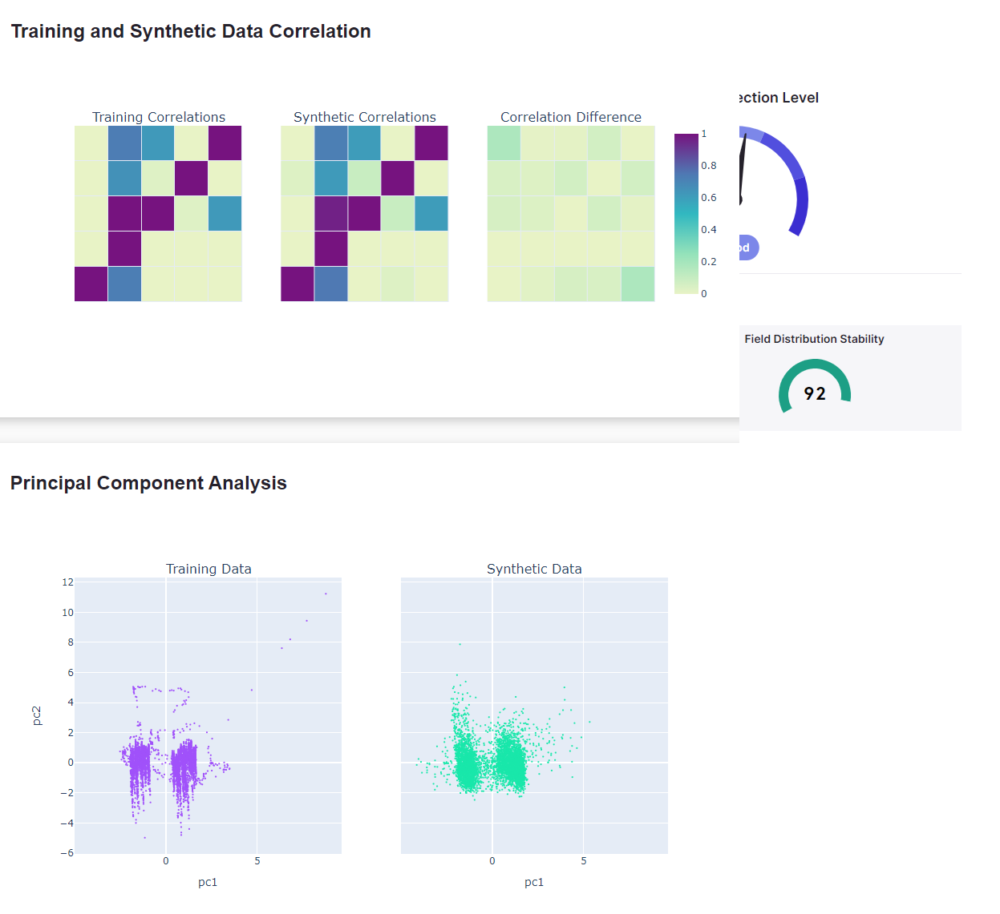

<div align="center">

<h1> Coding The Future Vivo <br> Python AI Backend Developer </h1>

</div>

# natty_or_not
Final challenge of the DIO Python Backend bootcamp. The objective is to showcase the myriad AI functionalities by using whicever AI tools currently available to produce an end-product. To summarize, I've used Blackbox and Gretel to create ML models that construct reliable synthetic datasets based on data from real meteoceanographic huoys equiped with sensors such as anemometers, ondographs and ADCPs. These synthetic datasets are useful for a number of data science applications such as testing the efficacy and accuracy of climate prediction models. _In theory_, given these synthetic datasets without further information, an unsuspecting data analyst / oceanographer / climate scientist could very well believe, after inspecting it, that said data actually comes from a real meteoceanographic buoy moored in some part of our ocean. Hahah, fooled them all!

The implications are somewhat disturbing, to say the least.


<div align="center">

</div>

# Anyway, _let's just hump into it:_

I began this project by feeding this exact information to an AI platform, namely Blackbox AI. This is the initial prompt:

```
Hello Blackbox. I am tasked with solving a challenge for a data science bootcamp. In this challenge, one must use whatever free AI tools currently available to develop an "end product". For example: provide a prompt about a subject so that an AI tool can expand on that subject in the form of a script for a podcast. Then, with that script, use an AI tool to generate an AI-voiceover of the script, emulating a real podcaster talking about said subject. This is just an example. In my case, I would like to use the following components:

- an AI tool for synthetic data generation such as gretel, mdclone or hazy. I want to generate a timeseries of sea surface temperature measurements on a point in the ocean, emulating data that could come from a meteoceanographic buoy with sensors installed. In particular, I would like a dataset of 1 year of daily SST measuments at a fictional point near the sea of Rio de Janeiro, Brazil.
- an AI tool for code generation and documentation such as replit, codiga or code9, which should generate a C++ code that will ingest the data create in the previous section and manipulate it by calculating basic statistics of the time series such as mean and standard deviation, which will then be used to define an interval of mean +/- 2 times the standard deviation. The dataset should then be filtered by removing outliers i.e. removing data points that are outside this interval.
- an AI tool for summarization and insights such as fathom, xembly or hume, which will then receive the original dataset and the new, filtered dataset, an generate a textual conclusion stating how many points were removed by this filtering process.
- finally, an AI tool for text-to-speech functionality that will create a voice-over of the synthesis created by the previous AI tool.

Do you think this is feasible? And, if so, can you help me achieve it?
```

### Turns out that the Blackbox AI _could_ indeed help me achieve this:

```
What an exciting project! I'm happy to help you explore the feasibility of this challenge and provide guidance on how to achieve it using various AI tools.

Feasibility: After reviewing your requirements, I believe it's entirely feasible to complete this project using the mentioned AI tools. Each component you've outlined can be achieved using the corresponding AI tools, and the workflow seems well-structured.

Component 1: Synthetic Data Generation You can use Gretel, MDClone, or Hazy to generate a timeseries of sea surface temperature measurements. Let's assume you choose Gretel. You can create a synthetic dataset with the following parameters:

Dataset type: Time series
Data points: 365 (1 year of daily measurements)
Variables: Sea surface temperature (SST)
Location: Fictional point near the Sea of Rio de Janeiro, Brazil
Distribution: You can choose a suitable distribution for SST, such as a normal distribution with a mean and standard deviation based on real-world data.

Component 2: Code Generation and Documentation You can use Replit, Codiga, or Code9 to generate a C++ code that ingests the synthetic data and performs the required calculations. Let's assume you choose Replit. You can create a new Replit project, specify the input dataset, and ask the AI to generate a C++ code that:

Reads the input dataset
Calculates the mean and standard deviation of the SST time series
Defines an interval of mean +/- 2 times the standard deviation
Filters the dataset by removing outliers (data points outside the interval)

Component 3: Summarization and Insights You can use Fathom, Xembly, or Hume to generate a textual conclusion based on the original and filtered datasets. Let's assume you choose Fathom. You can upload both datasets to Fathom and ask the AI to generate a summary that includes:

The number of data points removed by the filtering process
A brief description of the filtering process
Any other relevant insights or statistics about the datasets

Component 4: Text-to-Speech You can use various text-to-speech AI tools, such as Amazon Polly, Google Text-to-Speech, or IBM Watson Text to Speech, to generate a voice-over of the summary created by Fathom.

Next Steps: To get started, I recommend the following:

Create a Gretel account and generate the synthetic dataset according to your specifications.
Use Replit to generate the C++ code that ingests the synthetic data and performs the required calculations.
Upload both datasets (original and filtered) to Fathom and generate a summary.
Use a text-to-speech AI tool to create a voice-over of the summary.
If you need help with any of these steps or require more guidance on using these AI tools, feel free to ask, and I'll do my best to assist you.
```

Might as well follow his suggestions. We hence begin...

# .. STEP 1 - Create a synthetic dataset of SST with Gretel

Gretel can create synthetic datasets from original ones. In this case, I've used the public data from a buoy maintained by the brazilian CHM-PNBOIA program: this datasets encompasses data measured by anemometers, ondographs, ADCPs and other meteoceanographic sensors. Although the initial idea was only to generate tabular SST data, Gretel seems powerful enough to be able to replicate a complete dataset.

<div align="center">

</div>

Turns out that Gretel was already several steps ahead of me. The synthetic datasets can be created with or without outliers. In fact, it can be customized right down to its metaphorical toenails. I asked Blackbox to run me through the training process that Gretel was running in the background. Blackbox explained:

```
It looks like Gretel is processing your dataset using its ACTGAN (Active Conditional Tabular GAN) model. Here's a breakdown of what's happening:

Analyzing input data and checking for auto-params... Gretel is analyzing your input dataset to determine the optimal hyperparameters for the ACTGAN model. It's checking for automatic parameters (auto-params) that can be set based on the input data.

Found 3 auto-params that were set based on input data... Gretel has found three auto-params that can be set automatically based on the input data:

epochs: The number of training epochs for the ACTGAN model, set to 600.
batch_size: The batch size for training, set to 600.
force_conditioning: A flag to force conditioning on the input data, set to false.
Using updated model configuration... Gretel is using the updated model configuration, which includes the auto-params and other hyperparameters for the ACTGAN model. The configuration is represented as a JSON object.

ACTGAN model configuration The ACTGAN model configuration includes several components:

actgan: The ACTGAN model configuration.
privacy_filters: Settings for privacy filters, such as outlier detection and similarity measures.
data_source: The input dataset, which is your provided CSV file.
ref_data: Reference data for the model (not used in this case).
params: Hyperparameters for the ACTGAN model, including:
embedding_dim: The dimensionality of the embedding space.
generator_dim and discriminator_dim: The dimensions of the generator and discriminator neural networks.
generator_lr and discriminator_lr: The learning rates for the generator and discriminator.
generator_decay and discriminator_decay: The decay rates for the generator and discriminator.
batch_size: The batch size for training.
discriminator_steps: The number of discriminator steps per generator step.
binary_encoder_cutoff and binary_encoder_nan_handler: Settings for binary encoding and handling NaN values.
auto_transform_datetimes: A flag to automatically transform datetime columns.
log_frequency: A flag to log training frequency.
cbn_sample_size: The sample size for conditional batch normalization.
epochs: The number of training epochs.
pac: The number of parallel actors for conditional generation.
data_upsample_limit: The limit for upsampling the data.
conditional_vector_type: The type of conditional vector.
conditional_select_column_prob and conditional_select_mean_columns: Settings for conditional selection.
reconstruction_loss_coef: The coefficient for reconstruction loss.
force_conditioning: A flag to force conditioning on the input data.
generate: Settings for generating synthetic data, including the number of records to generate and the maximum number of invalid records.
evaluate: Settings for evaluating the model, including correlation columns, SQS report columns and rows, and mandatory columns.
Starting ACTGAN model training... Gretel is starting the ACTGAN model training process, which will run for 600 epochs.

Training data loaded... Gretel has loaded the training data, which consists of 14,157 records and 81 fields. The upsampling count is 0, indicating that no upsampling is needed.

Training epoch completed... Gretel is reporting the training loss for each epoch, including the generator loss (loss_g), discriminator loss (loss_d), and reconstruction loss (loss_r). The losses will decrease as the model converges.

That's a lot of information, but it should give you an idea of what's happening behind the scenes in Gretel. If you have any specific questions or concerns, feel free to ask!
```

Wow, thank you Blackbox. Already the scorpe of what I've accomplished in under 10 minutes using AI tools is starting to settle. And it's somewhat _unsettling_ har har har har!

Gretel is highly customizable. I've trained a couple of new models, tweaking here and there, and managed to create a synthetic dataset of excelent quality. This is not my subjective opinion, it's from the quality report, which ultimately means that Gretel managed to create a dataset that not only has the same shape and size of the original, but that also preserves the same overarching structure _and_ insights:

<div align="center">

</div>

Correlation analysis and Principal Component Analysis shows that the model created and the resulting datasets it produces emulate the qualities of the original data:

<div align="center">

</div>


# .. STEP 2 - the sky is the limit

At this point, we've already accomplished quite a bit. I will keep expanding the following sections as I learn more about other AI tools such as replit, fathom and amazon polly such as suggested by Blackbox. 